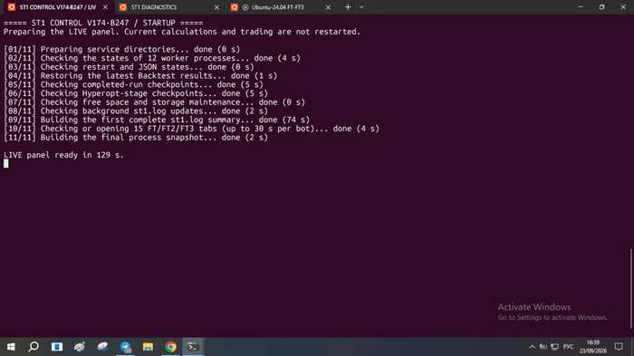
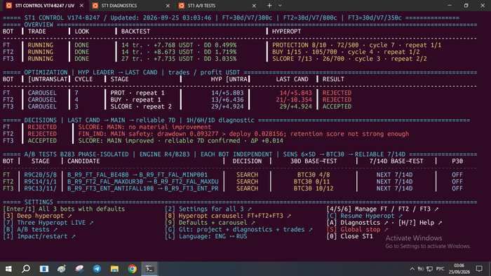
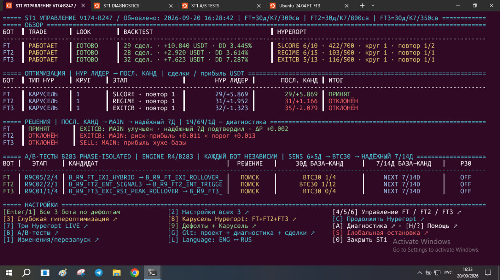
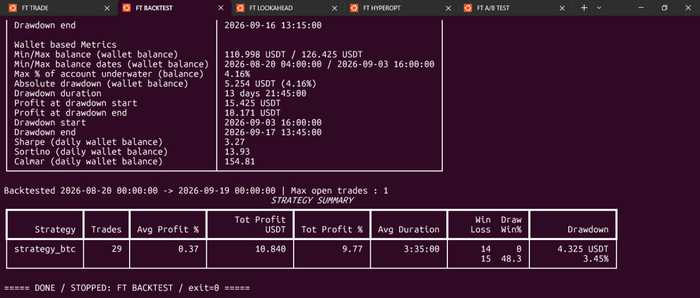
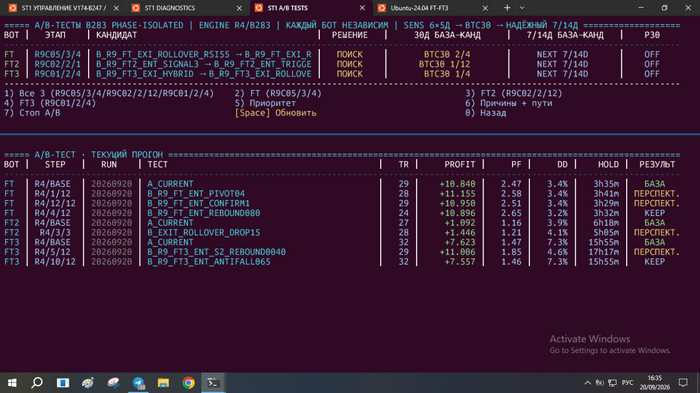

# AI Trading Research Lab (ATRL)

AI-assisted platform for automated trading research, backtesting and experimental validation.

## What it is

ATRL is an automated research environment for developing and validating trading systems through repeatable experiments.

It combines:

- workflow orchestration;
- backtesting and lookahead analysis;
- hyperparameter research;
- controlled A/B experiments;
- runtime diagnostics and failure analysis;
- reproducible research and evidence-based validation.

The public repository presents the engineering and research workflow without exposing the proprietary trading strategy implementation.

## Research Workflow

**Startup → Control → Live State → Backtest → A/B Research**

### 1. Startup

### 2. Control

### 3. Live State

### 4. Backtest

### 5. A/B Research

## Engineering Focus

- automation and orchestration
- experimental design
- A/B testing
- backtesting validation
- regression control
- diagnostics and failure analysis
- reproducibility
- evidence-based decision making

## Public / Private Boundary

This repository intentionally excludes:

- proprietary strategy source code;
- API keys, credentials and `.env` files;
- private production configuration;
- internal infrastructure details;
- private databases and unrestricted runtime logs.

## Status

Public portfolio / research showcase.
